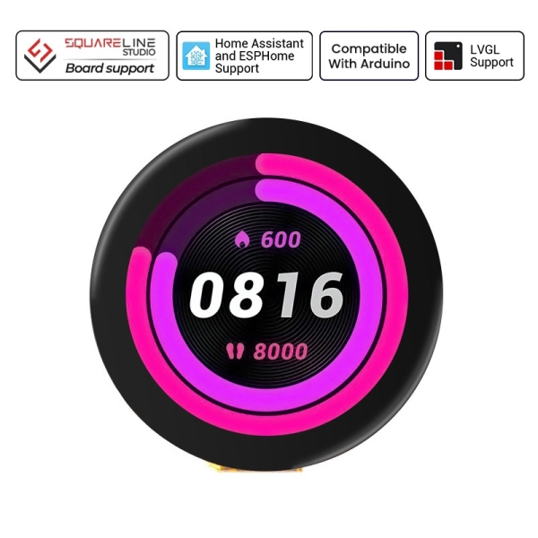
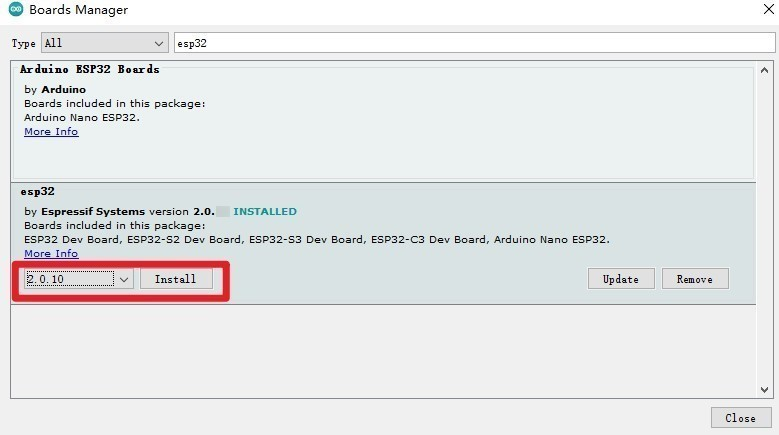
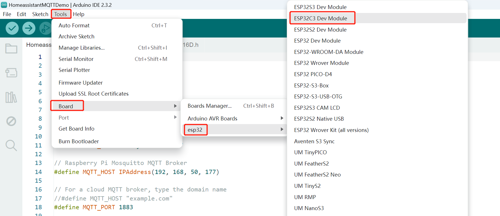

### 1, Product picture

### 2, Product version number

|      | Hardware | Software | Remark |
| ---- | -------- | -------- | ------ |
| 1    | V1.0     | V1.0     | latest |

### 3, product information

#### Display Module Specifications

| Main Chip        | ESP32-C3                                                  |
| ---------------- | --------------------------------------------------------- |
| Processor        | 32-bit RISC-V single-core processor, up to 160 MHz        |
| Memory           | 384 KB ROM400 KB SRAM (16 KB for cache)8 KB SRAM in RTC   |
| Size             | 1.28 inch                                                 |
| Resolution       | 240*240                                                   |
| Signal Interface | SPI                                                       |
| Touch Type       | Capacitive Touch                                          |
| Panel Type       | TFT LCD, IPS Panel                                        |
| Color Depth      | 262K                                                      |
| Brightness       | 350 cd/m²                                                 |
| Viewing Angle    | 178°                                                      |
| Button           | Rest Butto, Boot Button, Custom Button                    |
| Interface        | Type-C Interface, Battery Interface                       |
| Encoder          | With Button Function, Without Pin (Pin Size: 0.8mm*0.8mm) |
| Operation Power  | Module: DC5VMain Chip: 3.3V                               |
| Active Area      | 32.51*32.51mm                                             |
| Dimensions       | 42*42*9.8mm                                               |
| Net Weight       | 15g                                                       |

### 4, Use the driver module

### 5,Quick Start

##### Arduino IDE starts

1.Download the library files used by this product to the 'libraries' folder.

C:\Users\Documents\Arduino\libraries\

2.Open the Arduino IDE

3.Open the code configuration environment and burn it

##### Micropython starts

1,Right-click on an empty space in the project folder and select "Thonny" to open the project.

2,In thonny software, select the master and port, then run the program

### 6,Folder structure.

|--3D file： Contains 3D model files (.stp) for the hardware. These files can be used for visualization, enclosure design, or integration into CAD software.

|--Datasheet: Includes datasheets for components used in the project, providing detailed specifications, electrical characteristics, and pin configurations.

|--Eagle_SCH&PCB: Contains **Eagle CAD** schematic (`.sch`) and PCB layout (`.brd`) files. These are used for circuit design and PCB manufacturing.

|--example: Provides example code and projects to demonstrate how to use the hardware and libraries. These examples help users get started quickly.

|--factory_firmware: Stores pre-compiled factory firmware that can be directly flashed onto the device. This ensures the device runs the default functionality.

|--factory_sourcecode: Contains the source code for the factory firmware, allowing users to modify and rebuild the firmware as needed.

### 7,Pin definition

#define I2C_SDA 4

#define I2C_SCL 5

#define TP_INT 0

#define TP_RST -1

//encoder

#define ENCODER_A_PIN 19

#define ENCODER_B_PIN 18

#define SWITCH_PIN    8